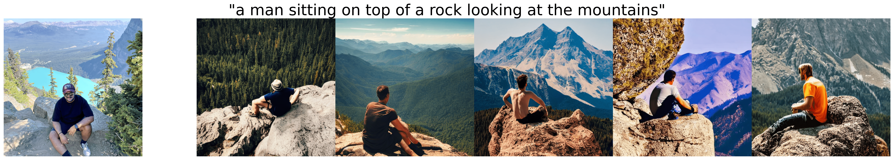
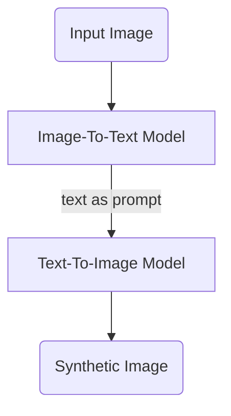

# SimSyn - Generate similar but synthetic images

Generate visually similar synthetic images using image captions as prompts.

[colab-badge]: <https://colab.research.google.com/assets/colab-badge.svg>
[![Open In Colab][colab-badge]](https://colab.research.google.com/github/hasibzunair/simsyn/blob/main/generate_images.ipynb)

      
      
    <em>
    </em>

### How does it work?

Given an input image, a `text` is generated which describes the image using an Image-To-Text model. Next, this `text` is used as a prompt to synthesize new `images` (hopefully similar to the input!) by using a Text-To-Image generative model. See flow chart below.

<!--- Flowchart made using https://github.com/mermaid-js/mermaid#examples -->

### Todos
* Prompt blending
* Morph between multiple image inputs
* Some other cool stuff

### Acknowledgements 
* https://colab.research.google.com/github/huggingface/notebooks/blob/main/diffusers/stable_diffusion.ipynb
* https://huggingface.co/nlpconnect/vit-gpt2-image-captioning 

### License 
Whatever licenses the pretrained models have.